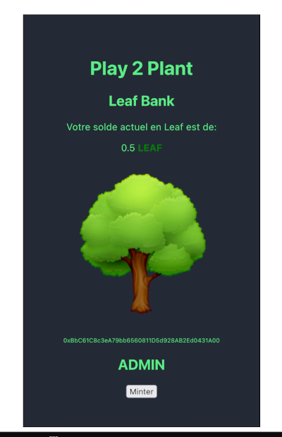

# Leaf dApp

Build with truffle and reactJS



## Installation without solidity contract
```
git clone git@github.com:Play2Plant/dApp-unbox.git
```

## Installation without solidity contract
```
git clone --recurse-submodules git@github.com:Play2Plant/dApp-unbox.git
```

## Install client dependencies
```
cd client/
npm install
```

## Start dApp
```
cd client/
npm start
```

